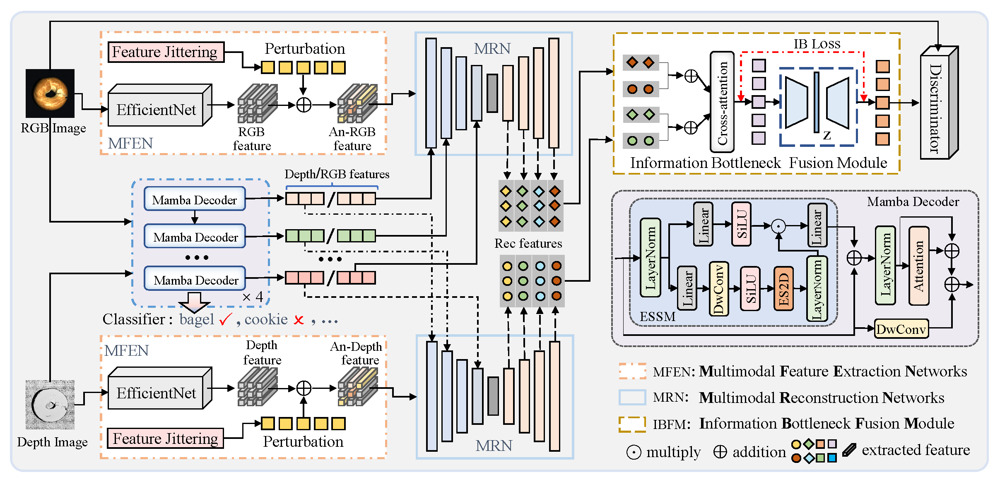
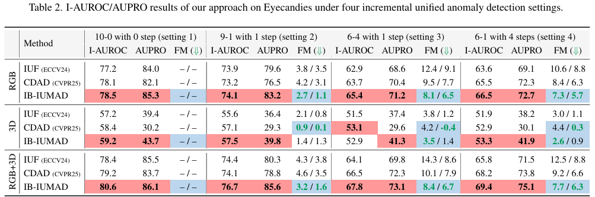

#### 🌟 This paper has been accepted to CVPR 2026.
#

<h1 align="center">Towards an Incremental Unified Multimodal Anomaly Detection: Augmenting Multimodal Denoising From an Information Bottleneck Perspective</h1>
<h3 align="center">Kaifang Long<sup>1</sup>, Lianbo Ma<sup>1</sup>, Jiaqi Liu<sup>3</sup>, Liming Liu<sup>1</sup>, Guoyang Xie<sup>2</sup>, </h3>
<h3 align="center"><sup>1</sup>Northeastern University, <sup>2</sup>CATL, <sup>3</sup>UBC </h3>

# Abstract
The quest for incremental unified multimodal anomaly detection seeks to empower a single model with the ability to systematically detect anomalies across all categories and support incremental learning to accommodate emerging objects/categories. Central to this pursuit is resolving the catastrophic forgetting dilemma, which involves acquiring new knowledge while preserving prior learned knowledge. Despite some efforts to address this dilemma, a key oversight persists: ignoring the potential impact of spurious and redundant features on catastrophic forgetting. In this paper, we delve into the negative effect of spurious and redundant features on this dilemma in incremental unified frameworks, and reveal that under similar conditions, the multimodal framework developed by naive aggregation of unimodal architectures is more prone to forgetting. To address this issue, we introduce a novel denoising framework called IB-IUMAD, which exploits the complementary benefits of the Mamba decoder and information bottleneck fusion module:  the former dedicated to disentangle inter-object feature coupling, preventing spurious feature interference between objects; the latter serves to filter out redundant features from the fused features, thus explicitly preserving discriminative information. A series of theoretical analyses and experiments on MVTec 3D-AD and Eyecandies datasets demonstrates the effectiveness and competitive performance of IB-IUMAD. 

# 🏗️ Method


# 🚀 Environment
Please refer to requirements.txt

# 💾 Dataset Preparation
We have already provided data processing for the MVTec 3D-AD dataset. For the Eyecandies dataset, you can refer to the .py file in A_ori_dataset_split/MVTec_3D-AD/.py for relevant processing.

You can also refer to Dataset Preparation and Configuration in <a href="https://github.com/jqtangust/IUF">IUF</a>; our RGB-D data is constructed according to the IUF standard.

# 🖥️ Training and Testing
Our paper presents experiments under four incremental settings: 10-0 with 0 step (training a unified model), 9-1 with 1 step,  6-4 with 1 step, and  6-1 with 4 steps. We strongly recommend that the authors incorporate Setting  1-1 with 10 steps into their experiments, as it would enhance the robustness and usefulness of their results. Below, we describe the training and testing procedures for these four incremental settings.
#### 🌟10-0 with 0 step
```bibtex
CUDA_VISIBLE_DEVICES=0,1,2,3 python ./tools/train_val.py --config /home/admin1/2Tsdb/lkf/uniform-3dad/IB-IUMAD/experiments/MVTec_3DAD/10_0_with_0_step/config_c1.yaml
```
If you encounter an error message indicating that the IB-IUMAD project does not exist, you can import the project before running ./tools/train_val.py (i.e., if `models.model_helper` is missing, you need to import it: `export PYTHONPATH="/home/admin1/2Tsdb/lkf/uniform-3dad/IUF-master-Mutlimodal"`.). As follows:
```bibtex
cd /home/admin1/2Tsdb/lkf/uniform-3dad/IB-IUMAD
export PYTHONPATH="/home/admin1/2Tsdb/lkf/uniform-3dad/IB-IUMAD"
```
Note that the commands for running the code are also provided in ./IB-IUMAD/experiments/MVTec_3DAD/10_0_with_0_step/run.sh; the following three settings are similar.
#### 🌟9-1 with 1 step
```bibtex
export PYTHONPATH="/home/admin1/2Tsdb/lkf/uniform-3dad/IUF-master-Mutlimodal"
#step1
CUDA_VISIBLE_DEVICES=0,1,2,3 python ./tools/train_val.py --config /home/admin1/2Tsdb/lkf/uniform-3dad/IB-IUMAD/experiments/MVTec_3DAD/9_1_with_1_step/config_c1.yaml
#step2
CUDA_VISIBLE_DEVICES=0,1,2,3 python ./tools/train_val.py --config /home/admin1/2Tsdb/lkf/uniform-3dad/IB-IUMAD/experiments/MVTec_3DAD/9_1_with_1_step/config_c10.yaml
```
If you encounter an error when executing step 2, where the parameter for `torch.load()` is None, you need to manually adjust the path in `./tools/train_val.py`: `lastest_model = os.path.join("config.save_path", "ckpt.pth.tar")`.
#### 🌟6-1 with 4 step
```bibtex
export PYTHONPATH="/home/admin1/2Tsdb/lkf/uniform-3dad/IB-IUMAD"
#step1
CUDA_VISIBLE_DEVICES=0,1,2,3 python ./tools/train_val.py --config /home/admin1/2Tsdb/lkf/uniform-3dad/IB-IUMAD/experiments/MVTec_3DAD/6_1_with_4_step/config_c1.yaml
#step2 
CUDA_VISIBLE_DEVICES=0,1,2,3 python ./tools/train_val.py --config /home/admin1/2Tsdb/lkf/uniform-3dad/IB-IUMAD/experiments/MVTec_3DAD/6_1_with_4_step/config_c9.yaml
#step3
CUDA_VISIBLE_DEVICES=0,1,2,3 python ./tools/train_val.py --config /home/admin1/2Tsdb/lkf/uniform-3dad/IB-IUMAD/experiments/MVTec_3DAD/6_1_with_4_step/config_c10.yaml
#step4
CUDA_VISIBLE_DEVICES=0,1,2,3 python ./tools/train_val.py --config /home/admin1/2Tsdb/lkf/uniform-3dad/IB-IUMAD/experiments/MVTec_3DAD/6_1_with_4_step/config_c11.yaml
#step5
CUDA_VISIBLE_DEVICES=0,1,2,3 python ./tools/train_val.py --config /home/admin1/2Tsdb/lkf/uniform-3dad/IB-IUMAD/experiments/MVTec_3DAD/6_1_with_4_step/config_c12.yaml
```
#### 🌟6-4 with 1 step
```bibtex
export PYTHONPATH="/home/admin1/2Tsdb/lkf/uniform-3dad/IB-IUMAD"
#step1
CUDA_VISIBLE_DEVICES=0,1,2,3 python ./tools/train_val.py --config /home/admin1/2Tsdb/lkf/uniform-3dad/IB-IUMAD/experiments/MVTec_3DAD/6_4_with_1_step/config_c1.yaml
#step2 
CUDA_VISIBLE_DEVICES=0,1,2,3 python ./tools/train_val.py --config /home/admin1/2Tsdb/lkf/uniform-3dad/IB-IUMAD/experiments/MVTec_3DAD/6_4_with_1_step/config_c12.yaml
```
#### 📧 If you still have questions about the incremental setup training process, please refer to <a href="https://github.com/jqtangust/IUF">IUF</a>.

# ⚡ Performance
Compared with other baselines, our model achieves the best performance:
#### 🌟 Quantitative evaluation in MvTec 3D AD.

#### 🌟 Quantitative evaluation in Eyecandies.

